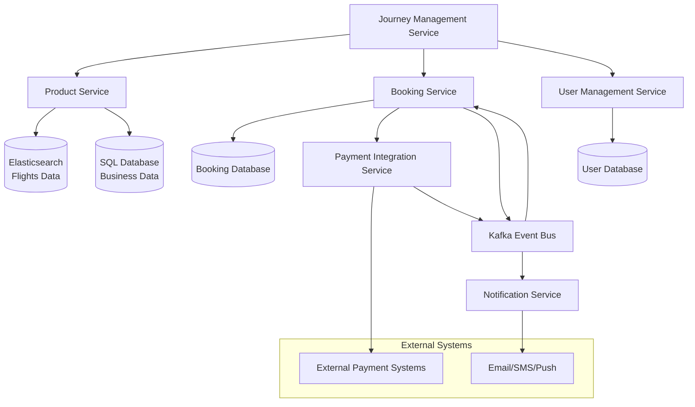

# Flight Booking Platform - Technical Documentation

## 1. System Overview

The Flight Booking Platform is designed as an extensible booking system that initially focuses on flight bookings but can be extended to other domains such as movie bookings. The system provides a comprehensive set of features for managing inventory, searching for products, booking seats, processing payments, and tracking booking states.

## 2. Domain Model

### Core Entities

- **Flight**: Represents a scheduled flight with route, timing, and pricing information
- **Seat**: Represents a bookable seat on a flight with type and pricing
- **Booking**: Represents a customer booking with selected seats and payment status
- **Stop**: Represents a flight segment with arrival/departure information
- **User**: Represents a user of the system with authentication and profile information

## 3. System Architecture

### 3.1 High-Level Architecture

The system follows a microservices architecture with the following key components:

1. **Journey Management Service**: Central orchestration service that handles authentication and coordinates workflows
2. **Product Service**: Manages product inventory (flights, movies) using Elasticsearch for flights data and SQL database for business data
3. **Booking Service**: Manages the booking process and state transitions
4. **Payment Integration Service**: Integrates with external payment systems
5. **Notification Service**: Handles notifications for booking state changes
6. **User Management Service**: Handles user authentication, authorization, and profile management

Each service maintains its own audit tables for tracking state transitions and system events within its domain.

### 3.2 Component Interactions

1. Journey Management Service orchestrates the overall booking flow and coordinates with User Management Service for authentication
2. Product Service uses two databases:
   - Elasticsearch for storing flights data for fast searching
   - SQL database for business data that doesn't require frequent querying
3. The Booking Service manages the booking state machine and directly communicates with the Payment Integration Service for payment processing
4. The Booking Service also listens to payment events from the Event Bus for asynchronous updates
5. The Payment Integration Service communicates with external payment providers and publishes events to the Event Bus
6. The Notification Service subscribes to events from the Event Bus to send notifications for state changes
7. The User Management Service handles user authentication, authorization, and profile management
8. Each service maintains its own audit tables for tracking state transitions within its domain

## 4. Key Components

### 4.1 Journey Management Service

The Journey Management Service acts as the central orchestrator for the booking platform:

- Handles authentication and authorization by integrating with User Management Service
- Coordinates workflows across services
- Provides a unified API for client applications
- Manages cross-service transactions
- Implements business rules for journey creation
- User authentication and profile data retrieval
- User preferences management

### 4.2 Product Service

The Product Service manages product inventory and search capabilities:

- Uses two databases:
  - Elasticsearch for storing flights data for fast searching and querying
  - SQL database for business data that doesn't require frequent querying
- Provides product creation and management APIs
- Handles inventory management
- Manages product metadata
- Implements business onboarding workflows
- Delivers fast search capabilities with multiple filters
- Supports faceted search, sorting, and pagination
- Implements caching of frequent searches

### 4.3 Booking Engine

The Booking Service manages the entire booking process:

- Seat selection and locking
- Booking state management
- Direct integration with Payment Integration Service for payment processing
- Listening to payment events from the Event Bus for asynchronous updates
- Booking expiration handling
- Booking retrieval and management
- Maintaining audit records of booking state transitions

### 4.4 Payment Integration

The Payment Integration Service handles all payment-related operations:

- Integration with external payment systems
- Processing payment requests from the Booking Service
- Payment status tracking
- Publishing payment events to the Event Bus
- Retry mechanisms for failed payments
- Refund processing
- Payment metadata storage

### 4.5 Notification Service

The Notification Service handles all communication with users:

- Subscribes to events from the Event Bus
- Sends notifications based on booking state changes
- Supports multiple notification channels (email, SMS, push)
- Templating for different notification types
- Delivery tracking and retry mechanisms

### 4.6 User Management Service

The User Management Service handles user authentication, authorization, and profile management:

- User registration and login
- Password management
- User profile management
- Role-based access control
- Integration with Journey Management Service for authentication

## 5. Non-Functional Requirements

### 5.1 Performance

- **Search Latency**: Elasticsearch optimization for 300-500ms search latency
- **Caching**: Redis caching for frequent searches and product details
- **Database Optimization**: Proper indexing and query optimization
- **Connection Pooling**: Efficient database connection management

### 5.2 Concurrency Control

- **Optimistic Locking**: For handling concurrent updates to products
- **Pessimistic Locking**: For seat booking to prevent double booking
- **Distributed Locks**: Using Redis for distributed locking of seats

### 5.3 Availability vs. Consistency

- **CAP Theorem**: System prioritizes availability over consistency for product searches
- **Eventual Consistency**: For product data updates
- **Strong Consistency**: For booking operations to prevent double booking

### 5.4 Monitoring and Metrics

- **Custom Metrics**: Each service publishes metrics for tracking its operations
- **Performance Metrics**: Response times, error rates, throughput
- **Business Metrics**: Booking conversion rates, payment success rates
- **System Metrics**: CPU, memory, disk usage, network traffic

### 5.5 Audit Trail

- **Service-Specific Audit Tables**: Each service maintains its own audit records
- **State Transition Logging**: All booking state transitions are logged in the Booking Service
- **Event Sourcing**: Reconstruction of booking state from events if needed

## 6. Security Considerations

### 6.1 Authentication and Authorization

- User Management Service handles user authentication, authorization, and profile management
- Role-based access control implemented at the User Management Service level
- API key authentication for business APIs
- OAuth 2.0 for user authentication
- Token validation and session management

### 6.2 Data Protection

- Encryption of sensitive data
- PCI DSS compliance for payment data
- GDPR compliance for user data
- Data masking in logs

## 7. Future Enhancements

- Support for additional product types (hotels, car rentals)
- Enhanced recommendation engine
- Mobile app integration
- Advanced analytics and reporting
- Dynamic pricing support

## 8. Conclusion

The Flight Booking Platform provides a robust, scalable, and extensible solution for managing flight bookings with the capability to extend to other booking domains. By following a microservices architecture and implementing event-driven design, the system ensures high performance, reliability, and maintainability.

> **Note**: For detailed low-level design components including entity field details, database schema, API design, state machine, extension mechanisms, technology stack, and deployment architecture, please refer to the [projectLLD.md](projectLLD.md) document.
