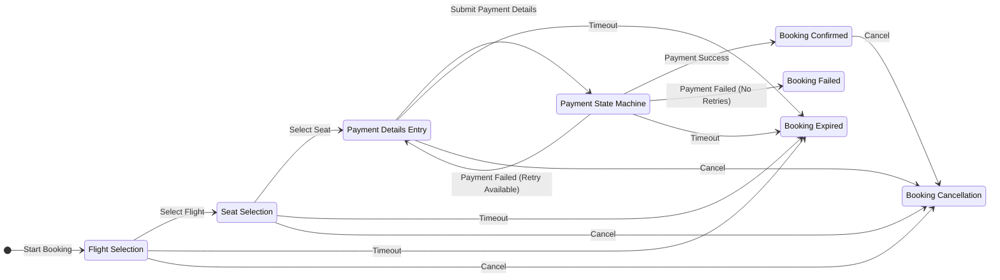
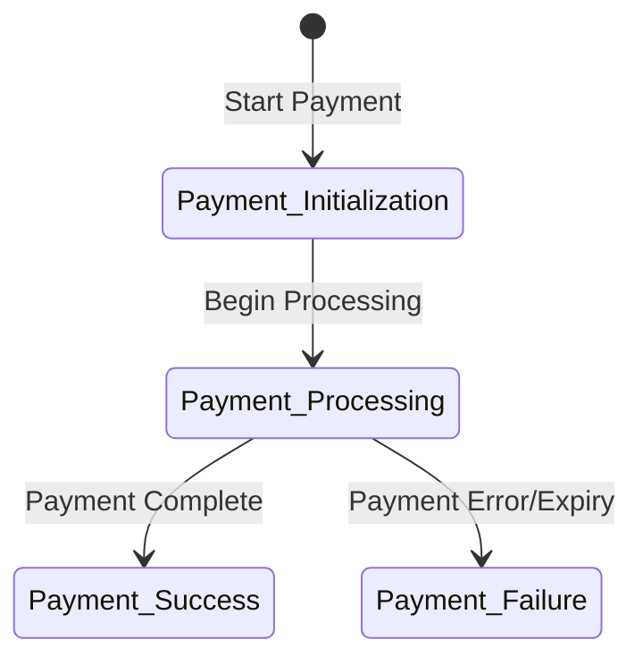

# Flight Booking Platform - Low-Level Design

## 1. Technology Stack

### 1.1 Backend
- **Language**: Kotlin 1.9.25
- **Framework**: Spring Boot 3.5.3
- **Database**: PostgreSQL with JOOQ for type-safe SQL, Elasticsearch for product data
- **Migration**: Flyway for database migrations
- **Search**: Elasticsearch for fast product searches
- **Messaging**: Apache Kafka for event-driven architecture
- **API Documentation**: OpenAPI 3.0
- **Testing**: JUnit 5, MockK

### 1.2 Infrastructure
- **Containerization**: Docker
- **Orchestration**: Kubernetes
- **CI/CD**: Jenkins/GitHub Actions
- **Monitoring**: Prometheus, Grafana
- **Logging**: ELK Stack (Elasticsearch, Logstash, Kibana)

## 2. Domain Model Details

### 2.1 Flight
- `flightId`: Unique identifier for the flight
- `date`: Date of the flight
- `flightStartTime`: Departure time of the flight
- `flightEndTime`: Arrival time of the flight
- `source`: Origin location
- `destination`: Final destination
- `stopList`: List of intermediate stops
- `priceMap`: Mapping of passenger types to prices

### 2.2 Seat Booking
- `stopId`: Reference to the stop
- `orderId`: Reference to the order
- `price`: Price of the seat booking
- `seatNo`: Seat number
- `passengerDetails`: Details of the passenger

### 2.3 Seat
- `seatNo`: Seat number
- `type`: Type of seat (e.g., Economy, Business, First Class)
- `price`: Price of the seat
- `stopId`: Reference to the stop

### 2.4 Booking
- `bookingId`: Unique identifier for the booking
- `customerId`: Reference to the customer
- `amount`: Total amount of the booking
- `seatBookings`: List of seat bookings
- `vendorOrderRef`: Reference to the vendor's order
- `status`: Current status of the booking
- `flight`: Reference to the flight
- `bookingDate`: Date when the booking was made
- `membership`: Membership details
- `paymentMetadata`: Payment-related information

### 2.5 Stop
- `arrTime`: Arrival time
- `depTime`: Departure time
- `arrAirport`: Arrival airport
- `depAirport`: Departure airport
- `seats`: List of seats available at this stop
- `aircraftId`: Reference to the aircraft
- `stopId`: Unique identifier for the stop

### 2.6 User
- `userId`: Unique identifier for the user
- `username`: Username for authentication
- `passwordHash`: Hashed password
- `email`: User's email address
- `phoneNumber`: User's phone number
- `roles`: User's roles for authorization
- `status`: Account status (active, suspended, etc.)
- `createdAt`: Account creation timestamp
- `lastLoginAt`: Last login timestamp

## 3. Data Models

### 3.1 Database Schema

#### Product Service
- Uses two databases:
  1. **Elasticsearch** for flights data:
     - `flights`: Flight information including routes, schedules, and pricing
     - `stops`: Information about flight stops
     - `seats`: Seat information for each stop
     - `product_audit`: Audit records for flight data changes
  
  2. **SQL Database** for business data:
     - `businesses`: Business information (airlines)
     - `business_audit`: Audit records for business data changes

#### Booking Service Database
- Uses PostgreSQL to store:
  - `bookings`: Booking information
  - `seat_bookings`: Information about booked seats
  - `booking_state_transitions`: Booking state transitions
  - `booking_audit`: Audit records for booking changes

#### User Management Service Database
- Uses PostgreSQL to store:
  - `users`: User information
  - `user_profiles`: User profile information
  - `user_audit`: Audit records for user changes

### 3.2 Elasticsearch Schema

The Product Service uses the following Elasticsearch index:

- `flights-index`: Stores flight data including:
  - Flight details (ID, date, start/end times)
  - Route information (source, destination)
  - Stop information
  - Seat availability and pricing
  - Airline information (reference to business data)

## 4. API Design

### 4.1 RESTful APIs

#### Journey Management Service

The Journey Management Service acts as an orchestration layer that coordinates between other services. It provides APIs for managing the journey state.

| Endpoint | Method | Description | Request | Response | Status Codes |
|----------|--------|-------------|---------|----------|--------------|
| `/api/v1/journey-state/{bookingId}` | GET | Get current journey state | **Path Params**: <br>- `bookingId`: String (required) | **Response**: <br>JourneyState <br>**Fields**: <br>- `bookingId`: String <br>- `currentState`: String <br>- `availableTransitions`: List<String> <br>- `lastUpdated`: DateTime | 200, 404, 500 |
| `/api/v1/journey-state/{bookingId}/transition` | POST | Transition journey state | **Path Params**: <br>- `bookingId`: String (required) <br>**Request Body**: <br>- `targetState`: String (required) <br>- `metadata`: Object (optional) | **Response**: <br>JourneyState <br>**Fields**: <br>- `bookingId`: String <br>- `currentState`: String <br>- `previousState`: String <br>- `availableTransitions`: List<String> <br>- `lastUpdated`: DateTime <br>- `success`: Boolean <br>- `errors`: List<Error> (if any) | 200, 400, 404, 500 |

#### Product Service APIs

| Endpoint | Method | Description | Request | Response | Status Codes |
|----------|--------|-------------|---------|----------|--------------|
| `/api/v1/flights/search` | GET | Search for flights | **Query Params**: <br>- `origin`: String (required) <br>- `destination`: String (required) <br>- `departureDate`: Date (required) <br>- `returnDate`: Date (optional) <br>- `passengers`: Integer (required) <br>- `cabinClass`: String (optional) <br>- `pageNumber`: Integer (optional) <br>- `pageSize`: Integer (optional) | **Response**: <br>List<Flight> <br>**Fields**: <br>- `flights`: List of Flight objects <br>- `totalResults`: Integer <br>- `pageNumber`: Integer <br>- `pageSize`: Integer | 200, 400, 500 |
| `/api/v1/flights/{flightId}` | GET | Get flight details | **Path Params**: <br>- `flightId`: String (required) | **Response**: <br>Flight <br>**Fields**: <br>- `id`: String <br>- `flightNumber`: String <br>- `airline`: Airline object <br>- `origin`: Airport object <br>- `destination`: Airport object <br>- `departureTime`: DateTime <br>- `arrivalTime`: DateTime <br>- `duration`: Integer (minutes) <br>- `aircraft`: Aircraft object <br>- `status`: String | 200, 404, 500 |
| `/api/v1/flights/{flightId}/seats` | GET | Get available seats for a flight | **Path Params**: <br>- `flightId`: String (required) | **Response**: <br>List<Seat> <br>**Fields**: <br>- `seats`: List of Seat objects <br>- `seatMap`: SeatMap object | 200, 404, 500 |
| `/api/v1/airports` | GET | Get list of airports | **Query Params**: <br>- `query`: String (optional) <br>- `country`: String (optional) <br>- `pageNumber`: Integer (optional) <br>- `pageSize`: Integer (optional) | **Response**: <br>List<Airport> <br>**Fields**: <br>- `airports`: List of Airport objects <br>- `totalResults`: Integer <br>- `pageNumber`: Integer <br>- `pageSize`: Integer | 200, 400, 500 |
| `/api/v1/airlines` | GET | Get list of airlines | **Query Params**: <br>- `query`: String (optional) <br>- `pageNumber`: Integer (optional) <br>- `pageSize`: Integer (optional) | **Response**: <br>List<Airline> <br>**Fields**: <br>- `airlines`: List of Airline objects <br>- `totalResults`: Integer <br>- `pageNumber`: Integer <br>- `pageSize`: Integer | 200, 400, 500 |

#### Booking Service APIs

| Endpoint | Method | Description | Request | Response | Status Codes |
|----------|--------|-------------|---------|----------|--------------|
| `/api/v1/bookings` | POST | Create a new booking | **Request Body**: <br>- `journeyId`: String (required) <br>- `seatIds`: List<String> (required) <br>- `passengers`: List<Passenger> (required) <br>- `contactDetails`: ContactDetails (required) <br>- `paymentDetails`: PaymentDetails (required) | **Response**: <br>Booking <br>**Fields**: <br>- `id`: String <br>- `reference`: String <br>- `status`: String <br>- `journey`: Journey object <br>- `passengers`: List of Passenger objects <br>- `seats`: List of Seat objects <br>- `contactDetails`: ContactDetails object <br>- `price`: Price object <br>- `createdAt`: DateTime <br>- `updatedAt`: DateTime | 201, 400, 500 |
| `/api/v1/bookings/{bookingId}` | GET | Get booking details | **Path Params**: <br>- `bookingId`: String (required) | **Response**: <br>Booking <br>**Fields**: <br>- `id`: String <br>- `reference`: String <br>- `status`: String <br>- `journey`: Journey object <br>- `passengers`: List of Passenger objects <br>- `seats`: List of Seat objects <br>- `contactDetails`: ContactDetails object <br>- `price`: Price object <br>- `createdAt`: DateTime <br>- `updatedAt`: DateTime | 200, 404, 500 |
| `/api/v1/bookings/{bookingId}` | PUT | Update booking details | **Path Params**: <br>- `bookingId`: String (required) <br>**Request Body**: <br>- `passengers`: List<Passenger> (optional) <br>- `contactDetails`: ContactDetails (optional) | **Response**: <br>Booking <br>**Fields**: <br>- `id`: String <br>- `reference`: String <br>- `status`: String <br>- `journey`: Journey object <br>- `passengers`: List of Passenger objects <br>- `seats`: List of Seat objects <br>- `contactDetails`: ContactDetails object <br>- `price`: Price object <br>- `createdAt`: DateTime <br>- `updatedAt`: DateTime | 200, 400, 404, 500 |
| `/api/v1/bookings/{bookingId}/cancel` | POST | Cancel a booking | **Path Params**: <br>- `bookingId`: String (required) <br>**Request Body**: <br>- `reason`: String (optional) | **Response**: <br>Booking <br>**Fields**: <br>- `id`: String <br>- `reference`: String <br>- `status`: String (CANCELLED) <br>- `cancellationDetails`: CancellationDetails object | 200, 400, 404, 500 |
| `/api/v1/bookings/search` | GET | Search for bookings | **Query Params**: <br>- `reference`: String (optional) <br>- `email`: String (optional) <br>- `lastName`: String (optional) <br>- `fromDate`: Date (optional) <br>- `toDate`: Date (optional) <br>- `status`: String (optional) <br>- `pageNumber`: Integer (optional) <br>- `pageSize`: Integer (optional) | **Response**: <br>List<Booking> <br>**Fields**: <br>- `bookings`: List of Booking objects <br>- `totalResults`: Integer <br>- `pageNumber`: Integer <br>- `pageSize`: Integer | 200, 400, 500 |

#### Payment Integration Service APIs

| Endpoint | Method | Description | Request | Response | Status Codes |
|----------|--------|-------------|---------|----------|--------------|
| `/api/v1/payments` | POST | Process a payment | **Request Body**: <br>- `bookingId`: String (required) <br>- `amount`: Amount (required) <br>- `currency`: String (required) <br>- `paymentMethod`: PaymentMethod (required) <br>- `billingAddress`: Address (required) | **Response**: <br>Payment <br>**Fields**: <br>- `id`: String <br>- `bookingId`: String <br>- `status`: String <br>- `amount`: Amount <br>- `currency`: String <br>- `paymentMethod`: PaymentMethod object <br>- `transactionId`: String <br>- `createdAt`: DateTime | 201, 400, 500 |
| `/api/v1/payments/{paymentId}` | GET | Get payment details | **Path Params**: <br>- `paymentId`: String (required) | **Response**: <br>Payment <br>**Fields**: <br>- `id`: String <br>- `bookingId`: String <br>- `status`: String <br>- `amount`: Amount <br>- `currency`: String <br>- `paymentMethod`: PaymentMethod object <br>- `transactionId`: String <br>- `createdAt`: DateTime | 200, 404, 500 |
| `/api/v1/payments/{paymentId}/refund` | POST | Refund a payment | **Path Params**: <br>- `paymentId`: String (required) <br>**Request Body**: <br>- `amount`: Amount (optional) <br>- `reason`: String (optional) | **Response**: <br>Refund <br>**Fields**: <br>- `id`: String <br>- `paymentId`: String <br>- `status`: String <br>- `amount`: Amount <br>- `reason`: String <br>- `transactionId`: String <br>- `createdAt`: DateTime | 200, 400, 404, 500 |
| `/api/v1/payments/webhook` | POST | Payment provider webhook | **Request Body**: <br>- Provider-specific payload | **Response**: <br>- HTTP 200 OK | 200, 400, 500 |

#### User Management Service APIs

| Endpoint | Method | Description | Request | Response | Status Codes |
|----------|--------|-------------|---------|----------|--------------|
| `/api/v1/users` | POST | Create a new user | **Request Body**: <br>- `email`: String (required) <br>- `password`: String (required) <br>- `firstName`: String (required) <br>- `lastName`: String (required) <br>- `phoneNumber`: String (optional) <br>- `address`: Address (optional) | **Response**: <br>User <br>**Fields**: <br>- `id`: String <br>- `email`: String <br>- `firstName`: String <br>- `lastName`: String <br>- `phoneNumber`: String <br>- `address`: Address object <br>- `createdAt`: DateTime | 201, 400, 500 |
| `/api/v1/users/{userId}` | GET | Get user details | **Path Params**: <br>- `userId`: String (required) | **Response**: <br>User <br>**Fields**: <br>- `id`: String <br>- `email`: String <br>- `firstName`: String <br>- `lastName`: String <br>- `phoneNumber`: String <br>- `address`: Address object <br>- `createdAt`: DateTime <br>- `updatedAt`: DateTime | 200, 404, 500 |
| `/api/v1/users/{userId}` | PUT | Update user details | **Path Params**: <br>- `userId`: String (required) <br>**Request Body**: <br>- `firstName`: String (optional) <br>- `lastName`: String (optional) <br>- `phoneNumber`: String (optional) <br>- `address`: Address (optional) | **Response**: <br>User <br>**Fields**: <br>- `id`: String <br>- `email`: String <br>- `firstName`: String <br>- `lastName`: String <br>- `phoneNumber`: String <br>- `address`: Address object <br>- `createdAt`: DateTime <br>- `updatedAt`: DateTime | 200, 400, 404, 500 |
| `/api/v1/users/search` | GET | Search for users | **Query Params**: <br>- `email`: String (optional) <br>- `firstName`: String (optional) <br>- `lastName`: String (optional) <br>- `pageNumber`: Integer (optional) <br>- `pageSize`: Integer (optional) | **Response**: <br>List<User> <br>**Fields**: <br>- `users`: List of User objects <br>- `totalResults`: Integer <br>- `pageNumber`: Integer <br>- `pageSize`: Integer | 200, 400, 500 |
| `/api/v1/auth/login` | POST | User login | **Request Body**: <br>- `email`: String (required) <br>- `password`: String (required) | **Response**: <br>AuthToken <br>**Fields**: <br>- `token`: String <br>- `expiresAt`: DateTime <br>- `userId`: String | 200, 401, 500 |
| `/api/v1/auth/logout` | POST | User logout | **Request Header**: <br>- `Authorization`: Bearer token | **Response**: <br>- HTTP 200 OK | 200, 401, 500 |

#### Notification Service

The Notification Service operates purely on an event-driven model, consuming events from the Kafka Event Bus. It does not expose any direct APIs.

### 4.2 Event-Driven APIs

The system publishes and consumes the following key events through the Kafka Event Bus:

#### Published Events
- Booking Service:
  - `booking-created`: When a new booking is created
  - `booking-updated`: When a booking is updated
  - `booking-confirmed`: When a booking is confirmed
  - `booking-cancelled`: When a booking is cancelled
  - `seat-locked`: When a seat is locked for booking

- Payment Integration Service:
  - `payment-initiated`: When payment is initiated
  - `payment-completed`: When payment is completed
  - `payment-failed`: When payment fails

#### Consumed Events
- Booking Service:
  - `payment-completed`: When payment is completed
  - `payment-failed`: When payment fails

- Notification Service:
  - `booking-created`: When a new booking is created
  - `booking-updated`: When a booking is updated
  - `booking-confirmed`: When a booking is confirmed
  - `booking-cancelled`: When a booking is cancelled
  - `payment-completed`: When payment is completed
  - `payment-failed`: When payment fails

## 5. State Machine

### 5.1 Booking State Machine

The booking process follows a state machine as illustrated in the diagram below:



### 5.2 Payment State Machine

The Payment State Machine (PSM) referenced in the booking state machine has its own internal states:



### 5.3 State Descriptions

#### Booking States
- **Flight Selection (F_Sel)**: User is selecting flight options
- **Seat Selection (S_Sel)**: User is selecting seats for the chosen flight
- **Payment Details Entry (PDE)**: User is entering payment information
- **Payment State Machine (PSM)**: Payment processing is in progress (handled by Payment Integration Service)
- **Booking Confirmed (B_Confirmed)**: Booking has been successfully confirmed
- **Booking Failed (B_Failed)**: Booking processing has failed, typically due to payment issues after retries are exhausted
- **Booking Expired (B_Expired)**: Booking has expired due to timeout at any stage
- **Booking Cancellation (Cancellation)**: Booking is being cancelled

#### Payment States
- **Payment Initialization (Payment_Init)**: Payment process is being initialized with payment provider
- **Payment Processing (Payment_Processing)**: Payment is being processed by the payment provider
- **Payment Success (Payment_Success)**: Payment has been successfully completed
- **Payment Failure (Payment_Failure)**: Payment has failed due to error or expiry

### 5.4 State Transitions

#### Booking Transitions
- **Start Booking**: System enters the Flight Selection state directly
- **Select Flight**: User selects a flight and moves to Seat Selection
- **Select Seat**: User selects seats and moves to Payment Details Entry
- **Submit Payment Details**: User submits payment information and payment processing begins
- **Payment Success**: Payment is successful, booking is confirmed
- **Payment Failed (Retry Available)**: Payment fails but retries are available, returns to Payment Details Entry
- **Payment Failed (No Retries)**: Payment fails and no retries remain, booking fails
- **Timeout**: Any state can timeout and move to Booking Expired
- **Cancel**: User can cancel from most states

#### Payment Transitions
- **Start Payment**: Begin the payment process
- **Begin Processing**: Payment details are validated and processing begins
- **Payment Complete**: Payment is successfully processed
- **Payment Error/Expiry**: Payment fails due to error or timeout

### 5.5 Timeout Handling

- Flight selection has a timeout (typically 30 minutes)
- Seat selections are held for a limited time (typically 15 minutes)
- Payment details entry has a timeout (typically 10 minutes)
- Payment processing has a timeout (typically 5 minutes)
- Any timeout will transition the booking to the Expired state
- Timeouts trigger appropriate events on the Event Bus

## 6. Extension Mechanism

### 6.1 Product Extension

The system is designed to be extended to support different product types:

1. **Abstract Product Interface**: Core product behaviors are defined in interfaces
2. **Product-Specific Implementations**: Each product type implements these interfaces
3. **Factory Pattern**: Product factories create appropriate implementations
4. **Strategy Pattern**: Different strategies for product-specific operations

### 6.2 Example: Adding Movie Booking Support

To extend the system for movie bookings:

1. Create a new Elasticsearch index for movie data
2. Implement movie-specific data models and mappings in Elasticsearch
3. Implement `MovieBookingStrategy` for movie-specific booking logic
4. Add movie-specific APIs to the Journey Management Service
5. Update the Product Service to handle movie-specific operations

## 7. Deployment Architecture

### 7.1 Infrastructure

- Kubernetes clusters for container orchestration
- Auto-scaling based on load
- Multi-region deployment for high availability
- Database replication and failover

### 7.2 CI/CD Pipeline

- Automated testing
- Continuous integration
- Continuous deployment
- Blue-green deployment strategy

## 8. Implementation Details

### 8.1 Service Implementation

#### Journey Management Service
- Controller layer for API endpoints
- Service layer for business logic
- Integration with User Management Service for authentication
- Orchestration of workflows across services

#### Product Service
- Elasticsearch repository for flight data
- JOOQ repository for business data
- Service layer for product management
- Search service for optimized queries

#### Booking Service
- State machine implementation
- Booking repository
- Payment integration client
- Event publishers and consumers

#### Payment Integration Service
- Payment provider adapters
- Payment processing service
- Event publishers for payment status updates

#### Notification Service
- Event consumers for booking and payment events
- Notification templates
- Notification channel adapters (email, SMS, push)

#### User Management Service
- Authentication service
- User repository
- Profile management service
- Role-based access control implementation

### 8.2 Database Implementation

- Flyway migrations for schema creation and updates
- JOOQ code generation from database schema
- Elasticsearch mappings for flight data
- Optimized indexes for frequent queries

## 7. Database Structure

### 7.1 PostgreSQL Tables

#### Users Table
```sql
CREATE TABLE users (
    userId VARCHAR(36) PRIMARY KEY,
    email VARCHAR(255) NOT NULL UNIQUE,
    password_hash VARCHAR(255) NOT NULL,
    first_name VARCHAR(100) NOT NULL,
    last_name VARCHAR(100) NOT NULL,
    phone_number VARCHAR(20),
    created_at TIMESTAMP NOT NULL DEFAULT NOW(),
    updated_at TIMESTAMP NOT NULL DEFAULT NOW(),
    last_login_at TIMESTAMP
);

CREATE INDEX idx_users_email ON users(email);
CREATE INDEX idx_users_name ON users(last_name, first_name);
```

#### User Addresses Table
```sql
CREATE TABLE user_addresses (
    id UUID PRIMARY KEY,
    user_id VARCHAR(36) NOT NULL REFERENCES users(userId) ON DELETE CASCADE,
    address_line1 VARCHAR(255) NOT NULL,
    address_line2 VARCHAR(255),
    city VARCHAR(100) NOT NULL,
    state VARCHAR(100),
    postal_code VARCHAR(20) NOT NULL,
    country VARCHAR(100) NOT NULL,
    is_default BOOLEAN NOT NULL DEFAULT FALSE,
    created_at TIMESTAMP NOT NULL DEFAULT NOW(),
    updated_at TIMESTAMP NOT NULL DEFAULT NOW()
);

CREATE INDEX idx_user_addresses_user_id ON user_addresses(user_id);
```

#### Bookings Table
```sql
CREATE TABLE bookings (
    bookingId VARCHAR(36) PRIMARY KEY,
    reference VARCHAR(10) NOT NULL UNIQUE,
    customerId VARCHAR(36) REFERENCES users(userId),
    amount DECIMAL(10, 2) NOT NULL,
    currency VARCHAR(3) NOT NULL,
    status VARCHAR(20) NOT NULL,
    contact_email VARCHAR(255) NOT NULL,
    contact_phone VARCHAR(20) NOT NULL,
    booking_date TIMESTAMP NOT NULL DEFAULT NOW(),
    updated_at TIMESTAMP NOT NULL DEFAULT NOW(),
    expired_at TIMESTAMP,
    cancelled_at TIMESTAMP,
    cancellation_reason TEXT
);

CREATE INDEX idx_bookings_reference ON bookings(reference);
CREATE INDEX idx_bookings_customer_id ON bookings(customerId);
CREATE INDEX idx_bookings_status ON bookings(status);
CREATE INDEX idx_bookings_booking_date ON bookings(booking_date);
```

#### Passengers Table
```sql
CREATE TABLE passengers (
    id UUID PRIMARY KEY,
    booking_id VARCHAR(36) NOT NULL REFERENCES bookings(bookingId) ON DELETE CASCADE,
    first_name VARCHAR(100) NOT NULL,
    last_name VARCHAR(100) NOT NULL,
    date_of_birth DATE NOT NULL,
    passport_number VARCHAR(50),
    passport_expiry DATE,
    nationality VARCHAR(100),
    created_at TIMESTAMP NOT NULL DEFAULT NOW(),
    updated_at TIMESTAMP NOT NULL DEFAULT NOW()
);

CREATE INDEX idx_passengers_booking_id ON passengers(booking_id);
```

#### Booking Flights Table
```sql
CREATE TABLE booking_flights (
    id UUID PRIMARY KEY,
    booking_id VARCHAR(36) NOT NULL REFERENCES bookings(bookingId) ON DELETE CASCADE,
    flightId VARCHAR(100) NOT NULL,
    flight_number VARCHAR(10) NOT NULL,
    airline_code VARCHAR(3) NOT NULL,
    source VARCHAR(3) NOT NULL,
    destination VARCHAR(3) NOT NULL,
    flight_start_time TIMESTAMP NOT NULL,
    flight_end_time TIMESTAMP NOT NULL,
    created_at TIMESTAMP NOT NULL DEFAULT NOW()
);

CREATE INDEX idx_booking_flights_booking_id ON booking_flights(booking_id);
CREATE INDEX idx_booking_flights_flight_id ON booking_flights(flightId);
```

#### Booking Seats Table
```sql
CREATE TABLE booking_seats (
    seatNo VARCHAR(5),
    stopId VARCHAR(36),
    orderId VARCHAR(36) NOT NULL REFERENCES bookings(bookingId) ON DELETE CASCADE,
    passenger_id UUID NOT NULL REFERENCES passengers(id) ON DELETE CASCADE,
    price DECIMAL(10, 2) NOT NULL,
    currency VARCHAR(3) NOT NULL,
    created_at TIMESTAMP NOT NULL DEFAULT NOW(),
    PRIMARY KEY (seatNo, stopId, orderId)
);

CREATE INDEX idx_booking_seats_order_id ON booking_seats(orderId);
CREATE INDEX idx_booking_seats_passenger_id ON booking_seats(passenger_id);
CREATE INDEX idx_booking_seats_stop_id ON booking_seats(stopId);
```

#### Stops Table
```sql
CREATE TABLE stops (
    stopId VARCHAR(36) PRIMARY KEY,
    arrTime TIMESTAMP NOT NULL,
    depTime TIMESTAMP NOT NULL,
    arrAirport VARCHAR(3) NOT NULL,
    depAirport VARCHAR(3) NOT NULL,
    aircraftId VARCHAR(36) NOT NULL
);

CREATE INDEX idx_stops_airports ON stops(arrAirport, depAirport);
CREATE INDEX idx_stops_aircraft_id ON stops(aircraftId);
```

#### Payments Table
```sql
CREATE TABLE payments (
    id UUID PRIMARY KEY,
    booking_id VARCHAR(36) NOT NULL REFERENCES bookings(bookingId),
    amount DECIMAL(10, 2) NOT NULL,
    currency VARCHAR(3) NOT NULL,
    status VARCHAR(20) NOT NULL,
    payment_method VARCHAR(20) NOT NULL,
    transaction_id VARCHAR(100),
    error_message TEXT,
    created_at TIMESTAMP NOT NULL DEFAULT NOW(),
    updated_at TIMESTAMP NOT NULL DEFAULT NOW(),
    completed_at TIMESTAMP
);

CREATE INDEX idx_payments_booking_id ON payments(booking_id);
CREATE INDEX idx_payments_transaction_id ON payments(transaction_id);
CREATE INDEX idx_payments_status ON payments(status);
```

#### Refunds Table
```sql
CREATE TABLE refunds (
    id UUID PRIMARY KEY,
    payment_id UUID NOT NULL REFERENCES payments(id),
    amount DECIMAL(10, 2) NOT NULL,
    currency VARCHAR(3) NOT NULL,
    status VARCHAR(20) NOT NULL,
    reason TEXT,
    transaction_id VARCHAR(100),
    created_at TIMESTAMP NOT NULL DEFAULT NOW(),
    updated_at TIMESTAMP NOT NULL DEFAULT NOW(),
    completed_at TIMESTAMP
);

CREATE INDEX idx_refunds_payment_id ON refunds(payment_id);
CREATE INDEX idx_refunds_transaction_id ON refunds(transaction_id);
```

#### Notifications Table
```sql
CREATE TABLE notifications (
    id UUID PRIMARY KEY,
    user_id VARCHAR(36) REFERENCES users(userId),
    booking_id VARCHAR(36) REFERENCES bookings(bookingId),
    type VARCHAR(50) NOT NULL,
    channel VARCHAR(20) NOT NULL,
    template VARCHAR(100) NOT NULL,
    data JSONB NOT NULL,
    status VARCHAR(20) NOT NULL,
    sent_at TIMESTAMP,
    created_at TIMESTAMP NOT NULL DEFAULT NOW(),
    updated_at TIMESTAMP NOT NULL DEFAULT NOW()
);

CREATE INDEX idx_notifications_user_id ON notifications(user_id);
CREATE INDEX idx_notifications_booking_id ON notifications(booking_id);
CREATE INDEX idx_notifications_type ON notifications(type);
CREATE INDEX idx_notifications_status ON notifications(status);
```

#### Booking State Transitions Table
```sql
CREATE TABLE booking_state_transitions (
    id UUID PRIMARY KEY,
    booking_id VARCHAR(36) NOT NULL REFERENCES bookings(bookingId),
    from_state VARCHAR(50) NOT NULL,
    to_state VARCHAR(50) NOT NULL,
    triggered_by VARCHAR(100) NOT NULL,
    metadata JSONB,
    created_at TIMESTAMP NOT NULL DEFAULT NOW()
);

CREATE INDEX idx_booking_state_transitions_booking_id ON booking_state_transitions(booking_id);
CREATE INDEX idx_booking_state_transitions_states ON booking_state_transitions(from_state, to_state);
```

### 7.2 Elasticsearch Mappings

#### Flights Index
```json
{
  "mappings": {
    "properties": {
      "flightId": { 
        "type": "keyword" 
      },
      "date": { 
        "type": "date" 
      },
      "flightStartTime": { 
        "type": "date" 
      },
      "flightEndTime": { 
        "type": "date" 
      },
      "source": {
        "type": "keyword"
      },
      "destination": {
        "type": "keyword"
      },
      "stopList": {
        "type": "nested",
        "properties": {
          "stopId": { "type": "keyword" },
          "arrTime": { "type": "date" },
          "depTime": { "type": "date" },
          "arrAirport": { "type": "keyword" },
          "depAirport": { "type": "keyword" },
          "aircraftId": { "type": "keyword" }
        }
      },
      "priceMap": {
        "type": "object"
      },
      "airline": {
        "properties": {
          "code": { "type": "keyword" },
          "name": { "type": "text" },
          "logo": { "type": "keyword" }
        }
      },
      "aircraft": {
        "properties": {
          "id": { "type": "keyword" },
          "type": { "type": "keyword" },
          "model": { "type": "keyword" }
        }
      }
    }
  }
}
```

#### Airports Index
```json
{
  "mappings": {
    "properties": {
      "code": { "type": "keyword" },
      "name": { "type": "text" },
      "city": { "type": "text" },
      "country": { "type": "text" },
      "location": { "type": "geo_point" },
      "timezone": { "type": "keyword" }
    }
  }
}
```

#### Airlines Index
```json
{
  "mappings": {
    "properties": {
      "code": { "type": "keyword" },
      "name": { "type": "text" },
      "logo": { "type": "keyword" },
      "country": { "type": "keyword" }
    }
  }
}
```

#### Seats Index
```json
{
  "mappings": {
    "properties": {
      "seatNo": { "type": "keyword" },
      "type": { "type": "keyword" },
      "price": { "type": "float" },
      "stopId": { "type": "keyword" },
      "isAvailable": { "type": "boolean" },
      "lockedUntil": { "type": "date" }
    }
  }
}
```

{{ ... }}
